# Tuning on p

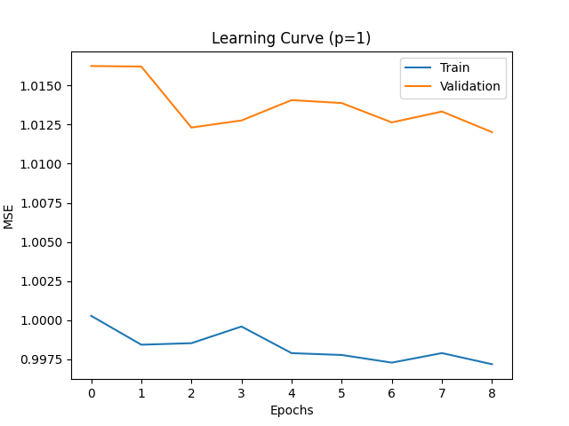
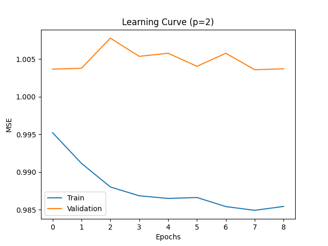
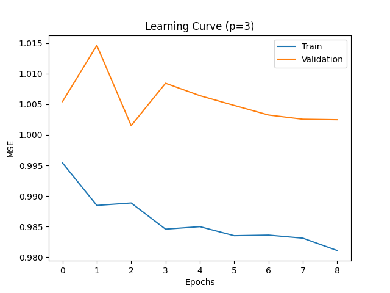
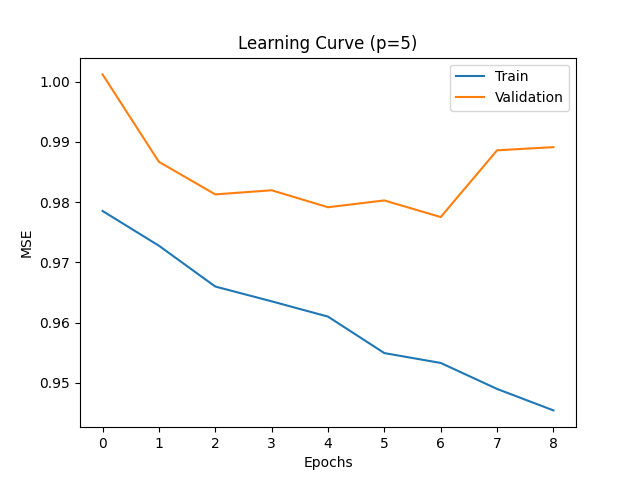
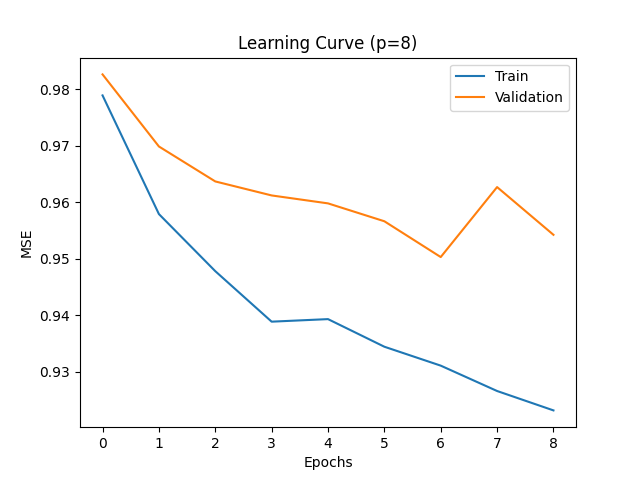
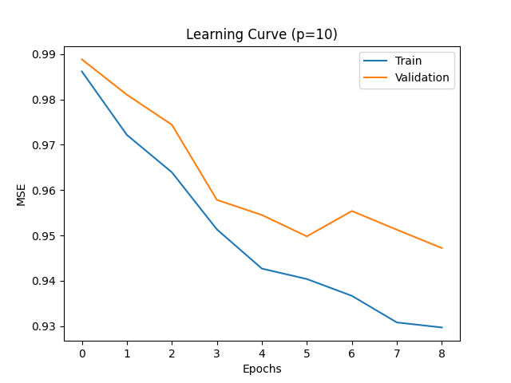
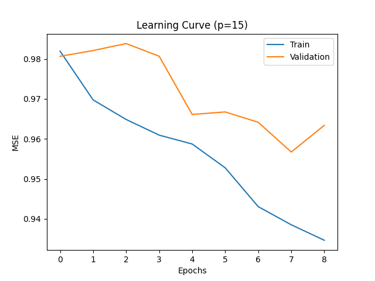
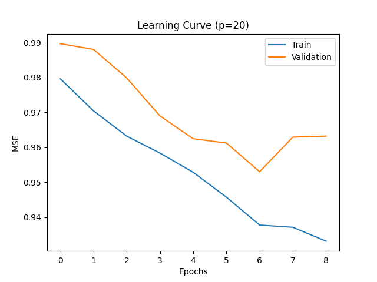

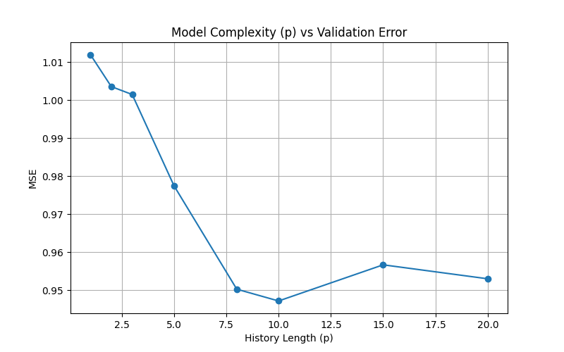

# Analytical equation

Identified Recurrence Relation:
x[k] = (-0.0751 * x[k-8]) + (0.1550 * x[k-7]) + (0.0903 * x[k-6]) + (-0.0749 * x[k-5]) + (-0.0636 * x[k-4]) + (-0.0435 * x[k-3]) + (-0.0415 * x[k-2]) + (0.0332 * x[k-1]) + (0.0029 * x[k-8]^2) + (-0.0011 * x[k-8] x[k-5]) + (-0.0012 * x[k-8] x[k-4]) + (-0.0040 * x[k-8] x[k-1]) + (-0.0030 * x[k-7] x[k-5]) + (0.0040 * x[k-7] x[k-4]) + (0.0016 * x[k-7] x[k-3]) + (-0.0013 * x[k-7] x[k-2]) + (0.0072 * x[k-7] x[k-1]) + (0.0030 * x[k-6] x[k-5]) + (0.0011 * x[k-6] x[k-3]) + (0.0060 * x[k-6] x[k-2]) + (-0.0035 * x[k-6] x[k-1]) + (-0.0060 * x[k-5]^2) + (-0.0055 * x[k-5] x[k-4]) + (0.0035 * x[k-5] x[k-3]) + (0.0032 * x[k-5] x[k-2]) + (0.0063 * x[k-5] x[k-1]) + (0.0017 * x[k-4]^2) + (-0.0076 * x[k-4] x[k-3]) + (-0.0027 * x[k-4] x[k-2]) + (0.0062 * x[k-3]^2) + (0.0064 * x[k-3] x[k-2]) + (0.0036 * x[k-3] x[k-1]) + (-0.0043 * x[k-2]^2) + (0.0020 * x[k-2] x[k-1]) + (-0.0048 * x[k-1]^2)

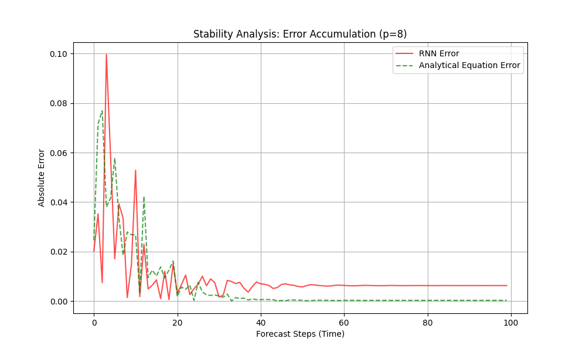

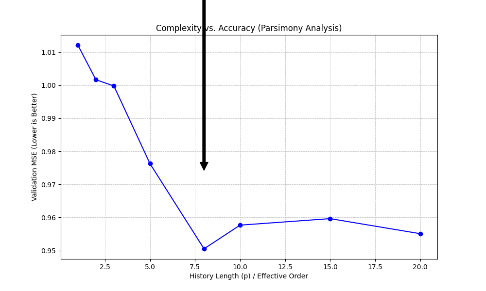

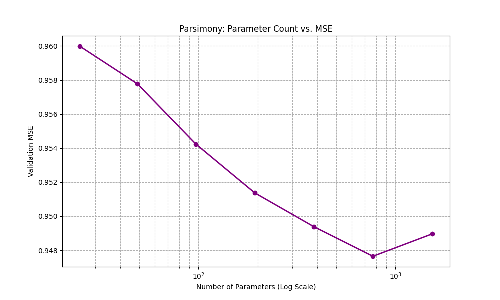