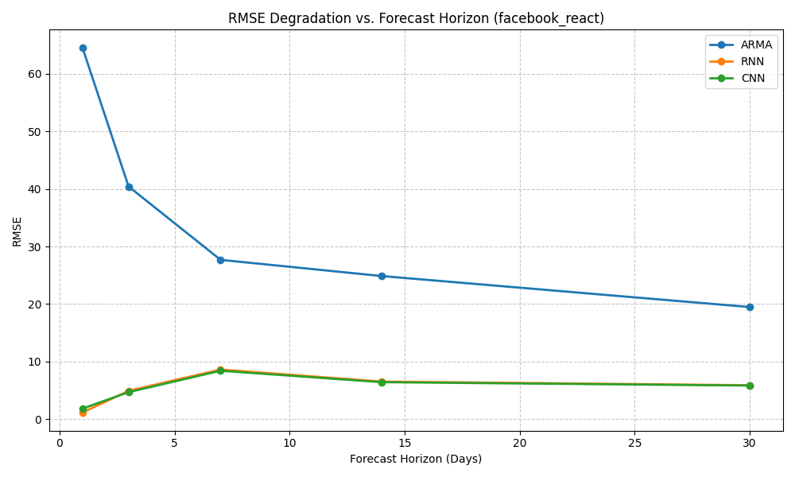
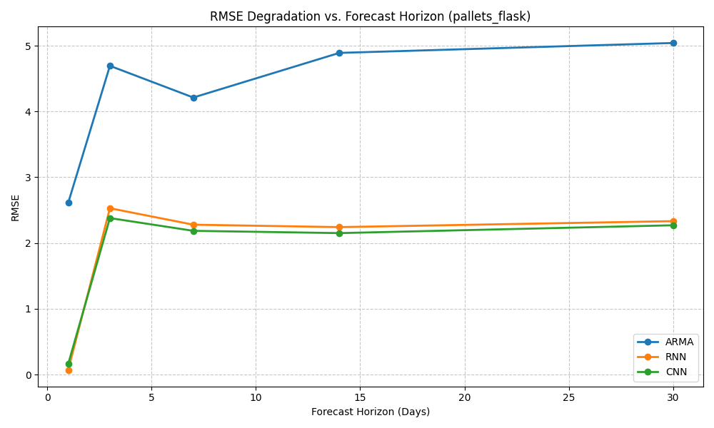
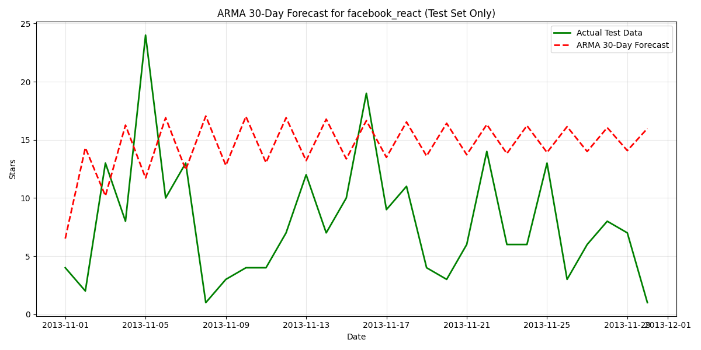
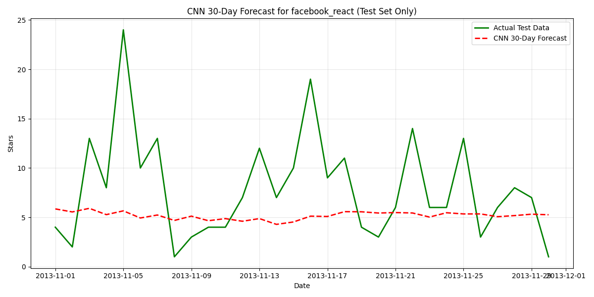
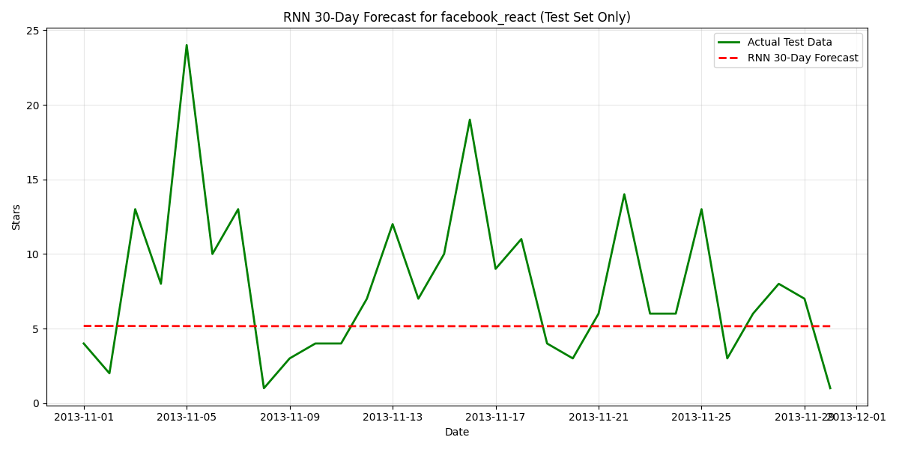
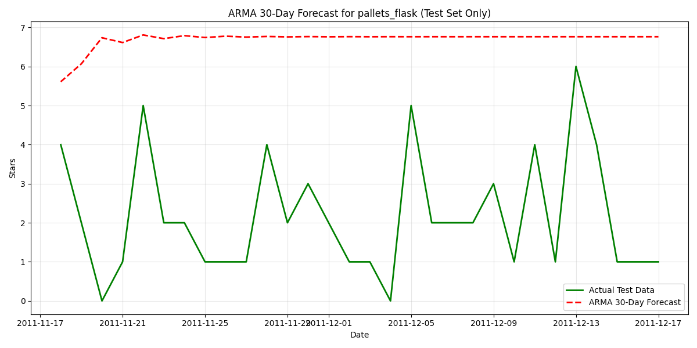
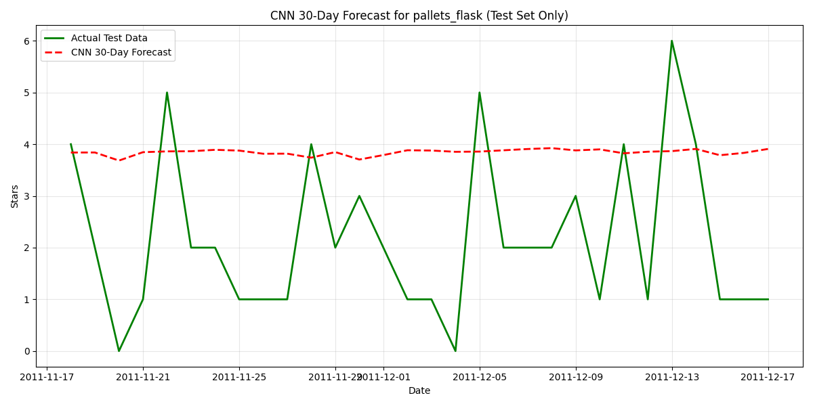
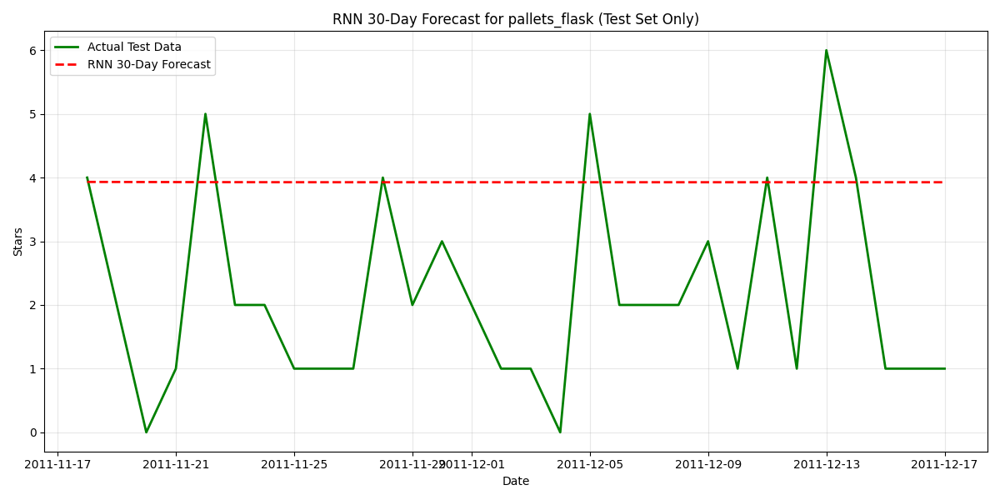

# **Data Preparation & Transformations — Summary Report**

This report summarizes the end-to-end data preprocessing pipeline implemented in **`prep_stars.py`** for preparing GitHub star-growth time series data for downstream modeling tasks.

---

## **1. Data Loading**

### **Function: `load_data()`**

* Loads the raw stars dataset from CSV.
* Converts the `timestamp` column into proper `datetime` objects.
* Returns a Pandas DataFrame containing:

  * `repository_id`
  * `timestamp`
  * `stars`

This ensures the dataset is ready for time-series alignment and chronological processing.

---

## **2. Cleaning & Aligning Repository-Level Time Series**

### **Function: `clean_and_align_time_series(df, repo_id)`**

This step isolates a single repository and prepares its star-growth series through several transformations:

### **2.1 Extracting Repository-Specific Data**

* Filters all rows belonging to a single `repo_id`.
* Sorts entries chronologically.

### **2.2 Reindexing to Continuous Daily Frequency**

* Converts `timestamp` into the DataFrame index.
* Reindexes the series to **daily** frequency using:

  ```python
  pd.date_range(start=min_date, end=max_date, freq='D')
  ```
* This ensures the dataset has one row per day, enabling uniform time intervals for forecasting models.

### **2.3 Filling Missing Star Values**

Because GitHub stars are cumulative, missing values are filled as follows:

* Forward fill (`ffill`)
* Backward fill (`bfill`) for early missing entries

This ensures continuity in the star-count signal.

### **2.4 Enforcing Monotonic Non-Decreasing Stars**

* Applies cumulative maximum:

  ```python
  repo_df['stars'] = repo_df['stars'].cummax()
  ```

Guarantees validity of cumulative star counts.

### **2.5 Removing Trailing Plateaus (Important Update)**

If the repository’s final star count remains constant for many days, the code removes unnecessary trailing repetition:

* Identify the **first** date when the final star count is reached.
* Truncate the dataset at that point.

This avoids misleading model inputs where hundreds of tail entries have the same value.

### **2.6 Final Output**

* Returns a cleaned, daily, trimmed time series with one column:

  ```
  stars
  ```

---

## **3. Domain Transformation**

### **Function: `transform_data_domain(df, domain)`**

Supports two types of modeling domains:

### **3.1 Cumulative Domain**

* Keeps the original cumulative star counts:

  ```
  stars_transformed = stars
  ```

### **3.2 Incremental Domain**

* Converts cumulative series into daily increments:

  ```python
  df['stars'].diff()
  ```
* First value is filled with the initial cumulative count.
* Negative increments (if any, due to data issues) are clipped to 0.

The incremental representation is important for models predicting daily growth rather than total stars.

---

## **4. Feature Scaling**

### **Function: `scale_data(df, scaler_type)`**

Supports two scaling methods:

### **4.1 Min–Max Scaling**

Maps values into `[0, 1]`.

### **4.2 Standard Scaling**

Transforms values into:

* zero mean
* unit variance

Scaling is applied to:

```
stars_transformed
```

A new column is added:

```
stars_transformed_scaled
```

The fitted scaler object is also returned for:

* inverse transformation
* applying to test data

---

## **5. Summary of Overall Pipeline**

The data preparation workflow accomplishes:

1. **Loading & parsing raw timestamped star events**
2. **Daily alignment of time series**
3. **Cleaning cumulative data (monotonic enforcement, filling)**
4. **Removing long plateau tails**
5. **Optional domain transformation**

   * cumulative
   * incremental
6. **Feature scaling for ML models**

This results in a clean, standardized, and model-ready time series for each repository.

---

# Metrics and Evaluation

|    Repository| Model | MAE (Single-step) | RMSE (Single-step)|  RMSE (H=1)|  RMSE (H=3)|  RMSE (H=7) | RMSE (H=14) | RMSE (H=30)|
|--------------|-------|-------------------|-------------------|-------------|-----------|-------------|-------------|------------|
|facebook_react | ARMA  |        11.179679  |         17.085344|   59.662419 |  37.701496  | 26.207199  |  24.262717  |  19.334206|
|facebook_react|   RNN  |        11.795233  |         17.507502 |   1.873237 |   4.809985 |   8.206939  |   6.270431 |    5.608933|
|facebook_react|   CNN  |        12.765127  |         18.234207 |   3.271922 |   4.957277 |   7.763614  |   6.066502  |   5.499517|
| pallets_flask | ARMA  |         5.610499  |          5.707675 |   2.494242 |   4.672019 |   4.080451  |   4.695642  |   4.814995|
| pallets_flask |  RNN  |         2.526904  |          2.671940 |   0.769092 |   2.044733 |   1.839231  |   1.737937  |   1.863179|
| pallets_flask |  CNN  |         3.417847  |          3.539829 |   0.068205  |  2.577227 |   2.358843  |   2.343635  |   2.407099|













# **Model Architecture Report**

This report describes the forecasting model architectures implemented in the project, spanning both **classical statistical models** and **deep learning–based neural network models**. Each architecture is designed to model temporal dynamics of repository star-growth patterns, both in cumulative and incremental domains.

---

# **1. Classical Model Architecture**

## **1.1 ARMA / ARIMA Models**

The classical model implemented is an **ARMA(p, q)** model, using the `statsmodels` implementation of **ARIMA(p, d, q)** with `d = 0`.

### **1.1.1 ARMA Fundamentals**

* **AR (Auto-Regressive) part (order p):**
  Uses past values of the time series to predict the future.
* **MA (Moving Average) part (order q):**
  Uses past error terms to correct the prediction.
* **No differencing (d = 0):**
  The model assumes stationarity.

### **1.1.2 Model Specification**

```python
model = ARIMA(train_series, order=(p, 0, q))
```

In the experiments, typical orders used:

* `arma_order = (1, 0, 0)` → AR(1)
* `arma_order = (2, 0, 1)` → ARMA(2,1)

### **1.1.3 Forecasting Mechanism**

* Multi-step forecasts use:
  `model_fit.get_forecast(steps=N)`
* Output provides:

  * `predicted_mean` — the point forecast
  * `conf_int` — 95% confidence intervals

### **1.1.4 Characteristics**

| Strengths                              | Weaknesses                                         |
| -------------------------------------- | -------------------------------------------------- |
| Good for stationary incremental series | Fails with strong nonlinearity                     |
| Low computational cost                 | Cannot learn long-range patterns                   |
| Interpretability (coefficients)        | Needs extensive preprocessing (stationarity tests) |

---

# **2. Deep Learning Model Architectures**

Two architectures are implemented for sequence forecasting:

* **LSTM-based Recurrent Neural Network**
* **1D Convolutional Neural Network (CNN)**

Both models take sliding windows of historical values and predict the next value.

---

# **2.1 RNN/LSTM Forecaster**

## **2.1.1 Overview**

The `RNNForecaster` implements an **LSTM-based neural network** for sequence prediction. LSTM is well-suited for capturing long-term dependencies and nonlinear temporal behavior.

### **2.1.2 Architecture Diagram**

```
Input Sequence (batch, seq_len, 1)
        ↓
LSTM Layer(s)
        ↓
Hidden State of Last Time Step
        ↓
Fully Connected (Linear) Layer
        ↓
Forecast Output
```

### **2.1.3 Component Breakdown**

#### **LSTM Layers**

```python
self.lstm = nn.LSTM(input_size, hidden_size, num_layers, batch_first=True)
```

* `input_size = 1` (single time-series feature)
* `hidden_size`: number of LSTM units (e.g., 50 or 64)
* `num_layers`: stacked LSTMs (e.g., 2)

#### **Output Layer**

```python
self.fc = nn.Linear(hidden_size, output_size)
```

Converts last LSTM output into a scalar forecast.

### **2.1.4 Forward Pass Logic**

1. Initialize hidden and cell states:
   `h0`, `c0`
2. Pass sequence through stacked LSTMs
3. Extract output from the last time step
4. Pass it through fully connected layer

### **2.1.5 Characteristics**

| Strengths                        | Weaknesses                 |
| -------------------------------- | -------------------------- |
| Captures nonlinear dependencies  | Slower to train            |
| Handles long-term memory         | Sensitive to window length |
| Works with raw normalized values | Requires more data         |

---

# **2.2 CNN-Based 1D Forecasting Architecture**

The second deep learning model, `CNN1DForecaster`, is a **1D convolutional neural network** for time-series prediction.

## **2.2.1 Architecture Overview**

```
Input (batch, seq_len, 1)
        ↓ (permute to match Conv1D format)
Conv1D (filters=64, kernel=3)
        ↓
ReLU
        ↓
MaxPool1D
        ↓
Conv1D (filters=128, kernel=3)
        ↓
ReLU
        ↓
MaxPool1D
        ↓
Flatten
        ↓
Fully Connected Layer
        ↓
Output (forecast)
```

## **2.2.2 Layer Details**

### **Conv1D Block 1**

```python
self.conv1 = nn.Conv1d(1, 64, kernel_size=3, padding='same')
self.pool1 = nn.MaxPool1d(kernel_size=2, stride=2)
```

### **Conv1D Block 2**

```python
self.conv2 = nn.Conv1d(64, 128, kernel_size=3, padding='same')
self.pool2 = nn.MaxPool1d(kernel_size=2, stride=2)
```

### **Flatten + Linear**

```python
self.fc = nn.Linear(self.fc_input_size, output_size)
```

`fc_input_size` is determined dynamically using a dummy forward pass.

## **2.2.3 Model Properties**

| Strengths                           | Weaknesses                               |
| ----------------------------------- | ---------------------------------------- |
| Very fast training                  | Might miss long-term sequential patterns |
| Learns local temporal features      | Requires sufficient receptive field      |
| Stable gradients, easy optimization | Performance sensitive to kernel size     |

---

# **3. Hyperparameter Overview**

### **3.1 Classical**

* `arma_order = (2, 0, 1)` or `(1, 0, 0)`
* Determined based on stationarity and ACF/PACF.

### **3.2 Deep Learning**

#### **Best RNN Parameters**

```json
{
  "lr": 0.001,
  "bs": 32,
  "hidden_size": 64,
  "num_layers": 2
}
```

#### **Best CNN Parameters**

```json
{
  "lr": 0.001,
  "bs": 32,
  "num_filters": 64,
  "kernel_size": 3
}
```

---

# **4. Comparison of Architectures**

| Model      | Captures Trend | Captures Seasonality | Captures Nonlinearity | Long-Term Memory | Speed     | Data Requirement |
| ---------- | -------------- | -------------------- | --------------------- | ---------------- | --------- | ---------------- |
| **ARMA**   | ✔              | ✖                    | ✖                     | ✖                | Very Fast | Low              |
| **LSTM**   | ✔              | ✔                    | ✔                     | ✔                | Medium    | Medium–High      |
| **1D CNN** | ✔              | Partial              | ✔                     | Limited          | Fast      | Medium           |

---

# **5. Summary**

This project explores three complementary forecasting architectures:

* **ARMA** for classical statistical modeling of stationary incremental star series.
* **LSTM-based RNN** for capturing nonlinear temporal dependencies and long-range patterns.
* **1D CNN** for fast feature extraction and short-range temporal modeling.

Each architecture contributes a different modelling perspective, allowing robust evaluation of classical vs. modern deep learning methods on the domain of GitHub star forecasting.

---

If you want, I can also write:

✅ **Training pipeline report**
✅ **Evaluation & metrics report**
✅ **Comparison charts**
✅ **Architecture diagrams (ASCII or PNG)**
