### 1. Reconstruction Loss: $\mathbb{E}_{q(z|x)}[\log p(x|z)]$
**The "Fidelity" Term**

This term represents the expected log-likelihood of the data. In your specific case, using **Binary Cross-Entropy (BCE)** implies the data is treated as a set of Bernoulli distributions (pixel values between 0 and 1).

* **Role:** Its primary job is to ensure the output (reconstruction) looks exactly like the input. It penalizes the network when the decoded image differs from the original.
* **Effect on Latent Representation:**
    * **Distinctness:** It pushes the encoder to create unique, distinct latent codes ($z$) for distinct inputs.
    * **Information Retention:** Without this term, the latent space would be pure noise, and the decoder would produce random garbage. It forces $z$ to capture the essential features required to rebuild $x$.

### 2. KL Divergence: $D_{KL}(q(z|x) || p(z))$
**The "Regularization" Term**

This term measures the difference between the learned distribution $q(z|x)$ (the approximate posterior produced by your encoder) and the prior distribution $p(z)$ (usually a Standard Normal Distribution, $\mathcal{N}(0, 1)$).

* **Role:** It acts as a regularizer, forcing the encoder's output to follow a nice, predictable Gaussian shape (centered at 0 with unit variance).
* **Effect on Latent Representation:**
    * **Continuity:** It forces similar inputs to have similar latent encodings.
    * **Completeness:** It ensures there are no "gaps" or "holes" in the latent space. This allows you to sample a random point from the normal distribution and decode it into a valid, meaningful image.
    * **Prevents Overfitting:** Without this term, the encoder effectively memorizes the training data by assigning each input a specific, isolated point in space (a Dirac delta function) rather than a distribution, making generation of *new* data impossible.

---

### Summary: The "Tug-of-War"
The shape of the learned latent representation is a result of a trade-off between these two terms:

| Term | What it wants | Result if dominant |
| :--- | :--- | :--- |
| **Reconstruction** | To describe the input perfectly. | The latent space becomes discrete and disjointed. Good reconstruction, but **poor generation** (cannot interpolate). |
| **KL Divergence** | To make the latent space a perfect unit sphere. | The latent space becomes pure noise. All inputs map to the same mean. **Poor reconstruction**, but the distribution is perfect. |

**The Sweet Spot:** The VAE balances these so that the latent space is **structured enough** to sample from (thanks to KL) but **distinct enough** to distinguish between different inputs (thanks to Reconstruction).

***

---

# Experimental Analysis
### Vary the weighting between reconstruction loss and KL divergence using a β-parameter

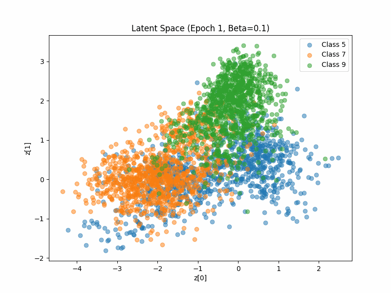
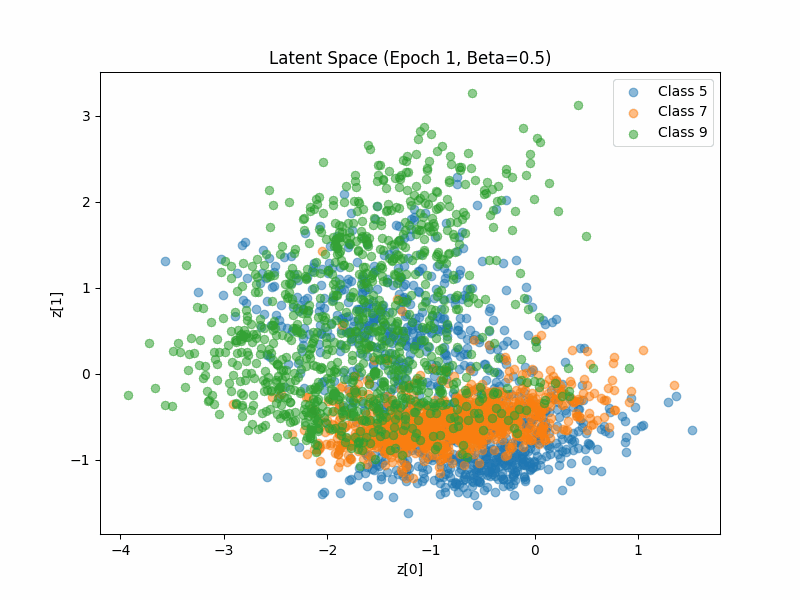
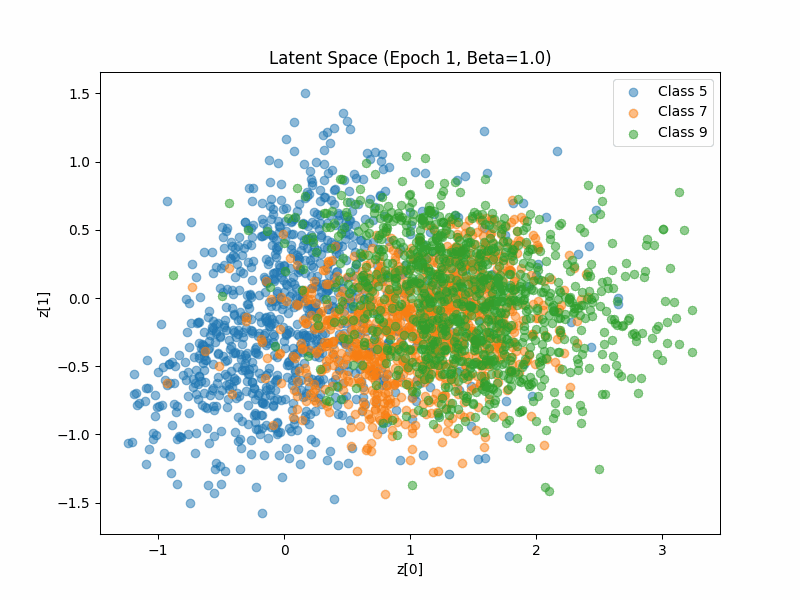
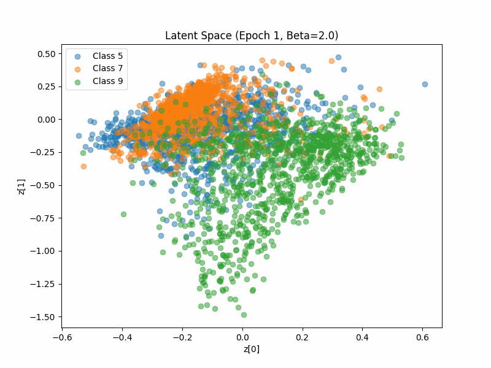

$$L = \text{Reconstruction Loss} + \beta \cdot D_{KL}$$

### 1. Image Sharpness & Quality
**Trend:** As $\beta$ **increases**, image sharpness **decreases**.

* **Low $\beta$ (e.g., 0.1):** The Reconstruction Loss dominates the objective function. The model prioritizes pixel-perfect fidelity over the shape of the latent distribution. This results in crisp, sharp reconstructions that look very close to the original inputs because the model is allowed to "memorize" fine details.
* **High $\beta$ (e.g., 1.0):** The KL Divergence term becomes strong. The model is forced to compress the data into a strict standard normal distribution. This acts as a strong information bottleneck. To satisfy this constraint, the model sacrifices high-frequency details (edges, textures), resulting in **blurrier** reconstructions.

### 2. Cluster Separation in Latent Space
**Trend:** As $\beta$ **increases**, cluster separation **decreases** (clusters overlap more).

* **Low $\beta$ (e.g., 0.1):** Since the penalty for deviating from the standard normal distribution is low, the encoder pushes different classes (e.g., T-shirts vs. Shoes) far apart in the latent space to minimize overlap errors. You will observe distinct, separated islands of data. While good for classification, this leaves "dead zones" or gaps between clusters.
* **High $\beta$ (e.g., 1.0):** The strong KL term forces *all* data points to cluster tightly around the origin $(0,0)$ to fit the unit Gaussian shape. This "smashes" the clusters together. While this increases overlap (making distinct separation harder), it ensures the space is continuous.

### 3. Diversity & Generative Capability
**Trend:** As $\beta$ **increases**, the validity of random sampling improves (better generation), but risk of "Posterior Collapse" increases.

* **Low $\beta$ (e.g., 0.1):** Because the latent space has "gaps" (as mentioned in Cluster Separation), random sampling from a standard normal distribution might land in a dead zone where the decoder hasn't learned anything. This leads to generating "garbage" images that don't look like valid items.
* **High $\beta$ (e.g., 1.0):** The latent space is smooth and continuous. Any point sampled from the normal distribution maps to a valid region of the decoder. This improves the **diversity of valid generation** (you can interpolate smoothly between a trouser and a bag).
* **Warning (Posterior Collapse):** If $\beta$ is too high (usually $>1$), the encoder might completely ignore the input $x$ and map everything to $0$. The decoder then learns to simply generate the "average" image of the dataset (a blurry gray blob) regardless of the input.

### Summary Table for Report

| Metric | $\beta = 0.1$ (Low) | $\beta = 0.5$ (Balanced) | $\beta = 1.0$ (High) |
| :--- | :--- | :--- | :--- |
| **Reconstruction** | Sharp, detailed, crisp edges. | Good balance. | Blurry, fuzzy edges. |
| **Latent Clusters** | distinct, separated "islands." | Clusters begin to merge. | Overlapping, centered at (0,0). |
| **Sampling** | High risk of invalid samples (garbage). | Smooth transitions. | High validity, continuous morphing. |

**Conclusion for your experiment:**
You should observe that **$\beta = 0.1$** gives the best looking *reconstructions* (sharpest), but **$\beta = 1.0$** gives the best *generative properties* (smoothest interpolation and densest latent space), likely making $\beta \approx 0.5$ or roughly $1.0$ the "sweet spot" for a standard VAE.

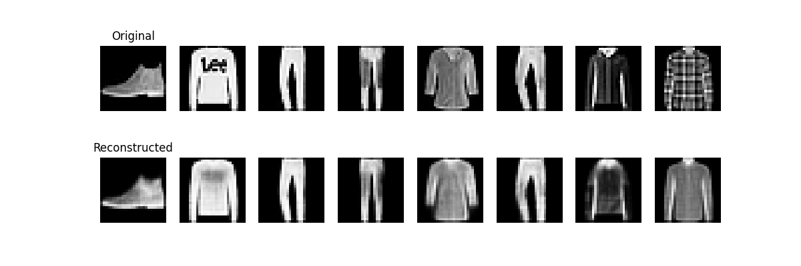
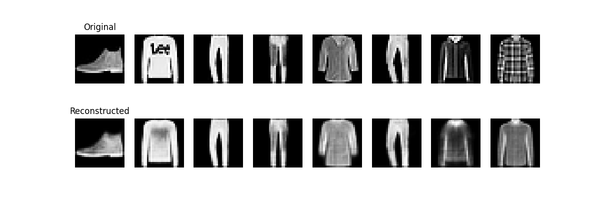

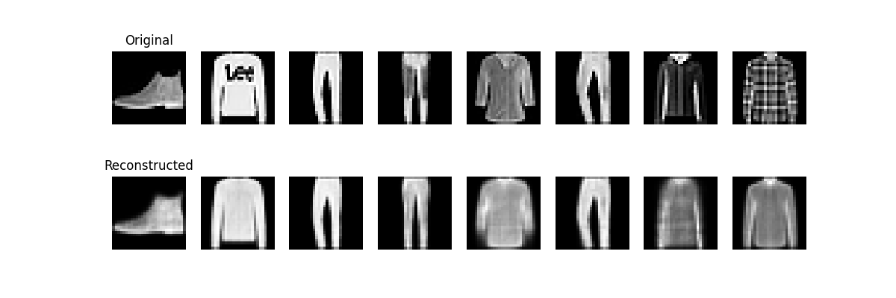

|beta|BCE|KLD|TOTAL LOSS|
|---|---|--|--|
|0.1|212.1478|48.2717|216.9750|
|0.5|217.6345|24.6616|229.9653|
|1.0|223.2043|16.1788|239.3832|
|2.0|230.8751|10.6397|252.1546|

# FID
|beta|fid|
|---|---|
|0.1| 1.3386|
|0.5| 0.5898|
|1.0|0.4074|
|2.0|0.4097|

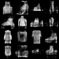
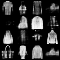
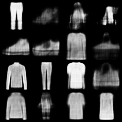
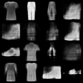

# Effect of Frozen Latent Parameters

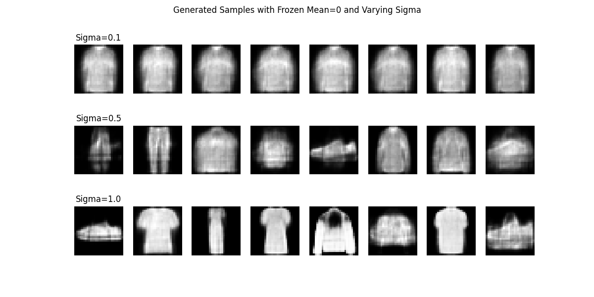

### 1. Visual Analysis of the Results
* **$\sigma = 0.1$ (Top Row):** The images show **extremely low diversity**. They all appear to be the same generic, ghostly shape—essentially a "mean image" of the entire dataset (a blend of a shirt, coat, and bag). They lack distinct features.
* **$\sigma = 0.5$ (Middle Row):** Distinct shapes begin to emerge. We can see silhouettes that resemble bags, pullovers, and dresses. There is more variation than the top row, but they still share a similar "central" structure.
* **$\sigma = 1.0$ (Bottom Row):** **High diversity**. We clearly see distinct classes: a trouser, a boot, a bag, a shirt. The shapes are sharper and recognizable as specific Fashion-MNIST categories.

---

### 2. Discussion: The Influence of Fixed Parameters

#### A. Effect on Diversity (The "Radius" of Exploration)
* **Observation:** Diversity increases significantly as $\sigma$ increases.
* **Reasoning:** In a well-trained VAE, the KL-divergence term pushes the latent vectors of the training data to approximate a Standard Normal Distribution ($\mathcal{N}(0, 1)$).
    * **At $\sigma = 0.1$:** You are sampling very tightly around the origin $(0,0)$. In the latent space, the origin represents the "global average" of all classes. The decoder outputs the weighted average of all training images, resulting in the generic blob seen in the first row.
    * **At $\sigma = 1.0$:** You are sampling from the full width of the standard normal distribution. This allows the random vectors ($\epsilon$) to reach the "outer regions" of the Gaussian sphere where specific class clusters (e.g., the "boot" cluster or "trouser" cluster) reside.

#### B. Effect on Sharpness (The "Mean" Problem)
* **Observation:** The images at $\sigma=1.0$ are sharper and have higher contrast than those at $\sigma=0.1$.
* **Reasoning:** The "average" of distinct shapes is inherently blurry (e.g., the average of a vertical trouser leg and a horizontal sandal is a blurry cross).
    * When you sample near the center ($\sigma=0.1$), the decoder interpolates between all classes simultaneously, causing blur.
    * When you sample further out ($\sigma=1.0$), the vector lands firmly inside a specific class manifold, allowing the decoder to produce a sharper, specific object.

#### C. Comparison to Standard Stochastic Sampling
The standard sampling equation is $z = \mu_{encoder}(x) + \epsilon \cdot \sigma_{encoder}(x)$.

| Feature | Standard Stochastic Sampling | Frozen Parameters ($\mu=0$, fixed $\sigma$) |
| :--- | :--- | :--- |
| **Goal** | **Reconstruction:** To recreate the specific input $x$. | **Generation:** To dream up *new* data from the prior. |
| **Information** | Uses the encoder's learned "identity" of the input. | Ignores specific input identity; assumes a neutral start. |
| **Outcome** | Produces a variation of the *original* image. | Produces random samples from the *distribution*. |

### Conclusion
Freezing $\mu=0$ turns the VAE from a "reconstruction machine" into a "generator."

The experiment demonstrates that **$\sigma$ controls the diversity-validity trade-off**:
* **Too low ($\sigma=0.1$):** The model collapses to the mean. It generates a safe, average representation of the dataset with zero diversity.
* **Standard ($\sigma=1.0$):** This matches the prior $p(z)$ the model was trained to emulate. It provides the best balance, generating distinct, recognizable classes (boots, shirts, bags) that cover the full diversity of the dataset.